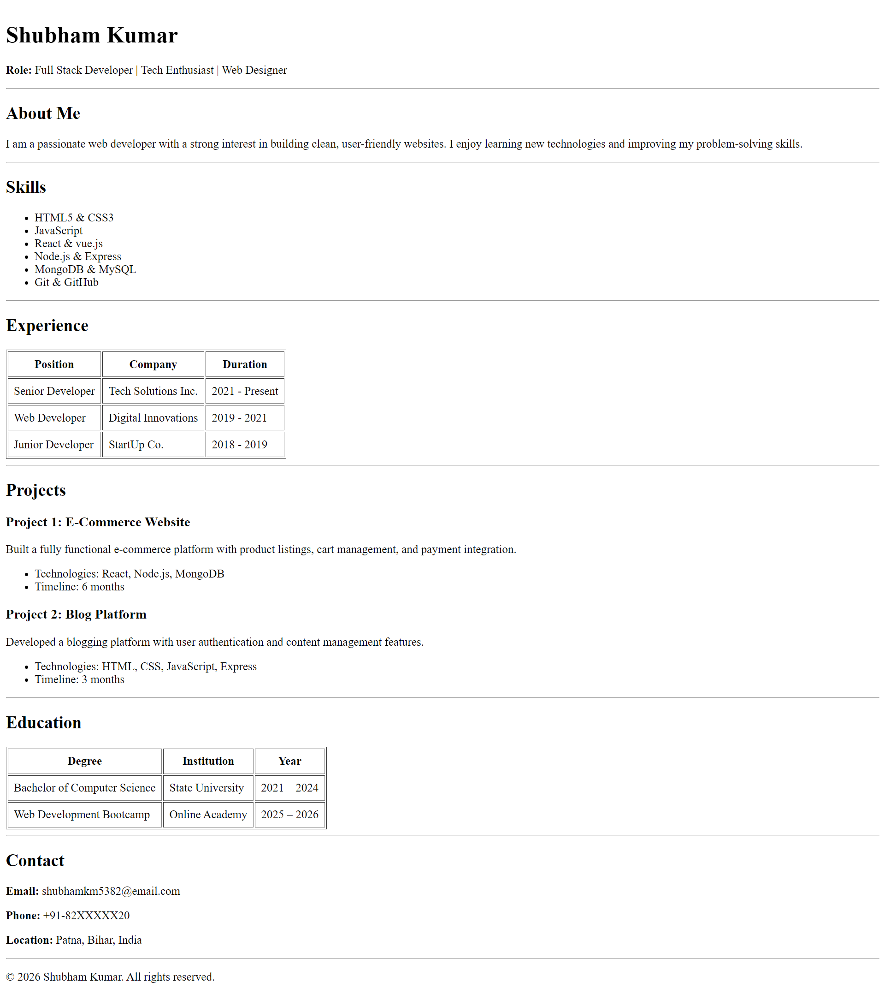

# 📄 Personal Resume Website

This project is a simple single-page resume website built using pure HTML.
It focuses on clean structure, semantic tags, and readability.

## 📸 Project Preview

## ✨ Features

- Header section with name and role
- About Me section
- Skills list
- Experience table
- Projects section
- Education table
- Contact details
- Footer

## 🛠️ Technologies Used

- HTML5

## 📁 Project Structure

HTML Resume Page/
│
├── index.html
├── resume-preview.png
└── README.md

## 🚀 How to Use

1. Clone or download this repository
2. Open `index.html` in any browser
3. View your resume

## 📌 Purpose

This project is created for academic assignment and HTML practice.

## 👤 Author

**Shubham Kumar**  
Full Stack Developer | Tech Enthusiast | Web Designer  
📍 Patna, Bihar, India

## 📜 License

This project is open-source for learning purposes.
